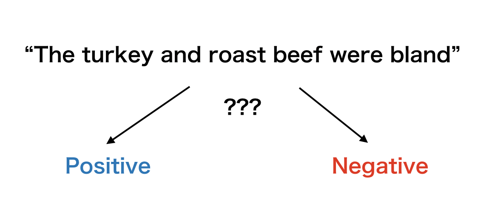
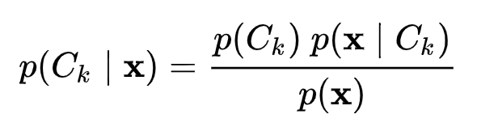

# gonbayes

 [](https://godoc.org/github.com/po3rin/gonbayes)



Simple Naive Bayes Classifier in Go.

## What is Naive Bayes

Naive Bayes is a simple technique for constructing classifiers: models that assign class labels to problem instances, represented as vectors of feature values, where the class labels are drawn from some finite set.

Bayes' theorem


## Quick Start

```bash
$ go run cmd/negaposi/main.go -s "i unlike this" -f "dataset/yelp_labelled.txt"
negative
```

## Example

```go
package main

import (
	// ...

	"github.com/po3rin/gonbayes"
)

const (
	posiLabel = "positive"
	negaLabel = "negative"
)

func loadNegaPosiDataset(file string) (map[string]string, error) {
	// please look cmd/negaposi/main.go
}

func main() {
    class := []string{posiLabel, negaLabel}
    dataset, err := loadNegaPosiDataset(*f)

    classifier := gonbayes.NewClassifier(class)
    for s, v := range dataset {
        classifier.Train(v, s)
    }

    result := classifier.Classify(*s)
    fmt.Println(result) // great success!! -> positive

    // encode trained classifier to gob file.
    classifier.Encode("negaposi_classifier.gob")
}
```

## Features

## store trained classifier

This package lets you to store trained classifier & A trained classifier can be used using Encode & Decode method.

```go
func (c *Classifier) Encode(fileName string) error
func (c *Classifier) Decode(fileName string) error
```

## Reference

thanks!

Sentiment analysis with a simple naive Bayes classifier in Go
https://sausheong.github.io/posts/sentiment-analysis-naive-bayes-classifier-in-go/

Naive Bayes Classifier From Scratch | Part 2 (NLP in Golang)
https://medium.com/@kcatstack/naive-bayes-classifier-from-scratch-part-2-nlp-in-golang-81c2a103ee06
